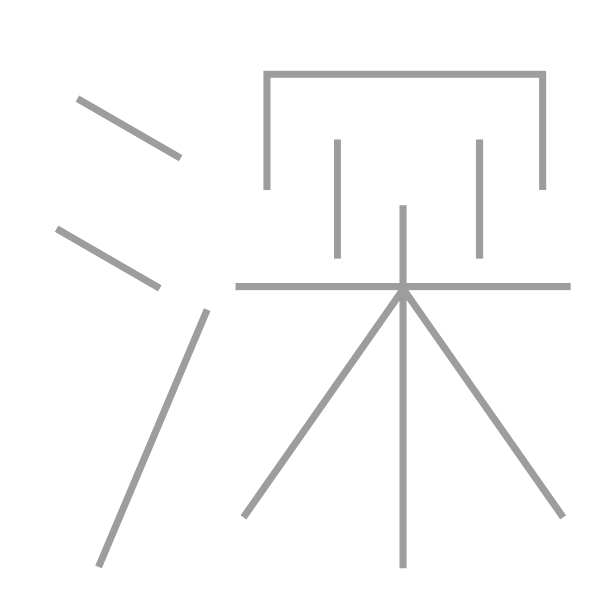

<!-- 一覧画面 -->

    
    

        

            
<video class="kanji-video" src="雨.mp4" playsinline muted loop preload="metadata"></video>

        

        
②鳥などを数える語。 ③「出羽(でわ)の国」の略。「羽州」「羽前」', 'white', 'video')">
            
<video class="kanji-video" src="羽.mp4" playsinline muted loop preload="metadata"></video>

        

        
②さびしい。まずしい。いやしい。「寒煙」「寒酸」「寒村」 ③かん。二十四節気の一つ。立春前のほぼ三〇日間。「寒中」「寒梅」「大寒」', 'white', 'video')">
            
<video class="kanji-video" src="寒.mp4" playsinline muted loop preload="metadata"></video>

        

        

            
<video class="kanji-video" src="叫.mp4" playsinline muted loop preload="metadata"></video>

        

        
②糸を張った楽器。弦楽器。「糸竹」「糸管」 ③数量の単位。一の一万分の一。 ④ごくわずか。「糸毫(シゴウ)」', 'white', 'video')">
            
<video class="kanji-video" src="糸.mp4" playsinline muted loop preload="metadata"></video>

        

        
②あつまり。つどい。「集会」「集落」 ③作品をあつめたもの。「画集」「詩集」', 'white', 'video')">
            
<video class="kanji-video" src="集.mp4" playsinline muted loop preload="metadata"></video>

        

        
②あつい季節。特に、夏の土用一八日間。「暑中」「大暑」', 'white', 'video')">
            
<video class="kanji-video" src="暑.mp4" playsinline muted loop preload="metadata"></video>

        

        
②建築や器具の用材。「木刀」「材木」 ③五行の一つ。 ④七曜の一つ。木曜。 ⑤かざりけがない。「木訥(ボクトツ)」', 'white', 'video')">
            
<video class="kanji-video" src="木.mp4" playsinline muted loop preload="metadata"></video>

        

        
②見る。見つめる。「目撃」「注目」 ③かなめ。要点。「眼目」「要目」 ④かしら。主だった人。「頭目」 ⑤見出し。な。なまえ。「目次」「品目」 ⑥小分けしたもの。「科目」「項目」 ⑦生物分類上の一段階。「霊長目」 ⑧かお。名誉。「面目」 ⑨いま。ただいま。「目下」 ⑩きざみ。さかい。すじ。「木目」', 'white', 'video')">
            
<video class="kanji-video" src="目.mp4" playsinline muted loop preload="metadata"></video>

        

        
②山にたちこめる気。もや。「嵐気」「青嵐」', 'white', 'video')">
            
<video class="kanji-video" src="嵐.mp4" playsinline muted loop preload="metadata"></video>

        

        
②物事が多く集まっていること。「林立」「書林」', 'white', 'video')">
            
<video class="kanji-video" src="林.mp4" playsinline muted loop preload="metadata"></video>

        

    

    <!-- 【深】広域滑らかグラデーション ＆ 泡エリア -->
    

        

            
②おくぶかい。「深遠」「深長」 ③はなはだしい。「深刻」 ④ねんごろ。こまやかな。「深交」「深情」 ⑤色がこい。「深紅」 ⑥夜がふける。「深更」', 'gradient', 'image')">
                

                    
                

            

        

    

    

        
②あかり。あかりがつく。「明滅」「灯明」 ③あきらか。あきらかにする。「明確」「証明」 ④さとい。かしこい。「明君」「賢明」 ⑤あける。夜があける。また、つぎの。あす。「明晩」「未明」 ⑥神。また、神聖なもの。「神明」 ⑦みん。中国の王朝名。', 'black', 'video')">
            
<video class="kanji-video" src="明.mp4" playsinline muted loop preload="metadata"></video>

        

        
②くらます。まどわす。「眩惑」 ③まぶしい。まばゆい。 ④まう。まどう。判断がみだれる。', 'black', 'video')">
            
<video class="kanji-video" src="眩.mp4" playsinline muted loop preload="metadata"></video>

        

        
②ひかり。日月などのひかり。「月影」「光影」 ③光に映し出されたすがた。かたち。「影像」「印影」「撮影」 ④まぼろし。', 'black', 'video')">
            
<video class="kanji-video" src="影2.mp4" playsinline muted loop preload="metadata"></video>

        

        
②まどわす。たぶらかす。「幻術」「幻惑」', 'black', 'video')">
            
<video class="kanji-video" src="幻.mp4" playsinline muted loop preload="metadata"></video>

        

        
②かがやかしいこと。ほまれ。名声。「光臨」「栄光」 ③時間。とき。「光陰」「消光」 ④ありさま。けしき。「光景」「風光」', 'black', 'video')">
            
<video class="kanji-video" src="光.mp4" playsinline muted loop preload="metadata"></video>

        

        
②とし。年月。「星霜」 ③重要な人物。「巨星」「将星」 ④めあて。小さな点。「図星」', 'black', 'video')">
            
<video class="kanji-video" src="星.mp4" playsinline muted loop preload="metadata"></video>

        

    

<!-- 詳細画面 -->

    
← もどる

    

        <video id="main-kanji-video" src="" playsinline loop style="display: none;"></video>
        
    

    

